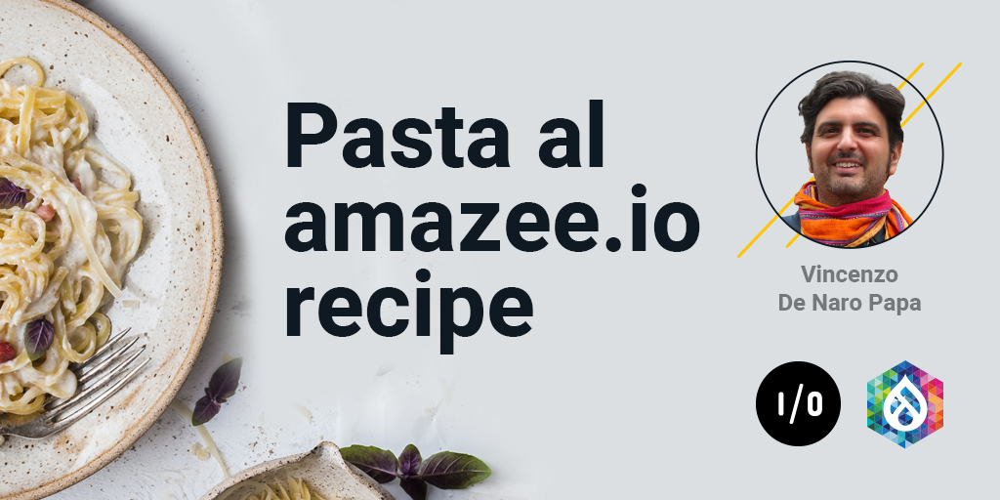

# Pasta al amazee.io

Catch amazee.io Systems Engineer, Vincenzo De Naro’s, recipe for his wildly popular and delicious Pasta al amazee.io presented live at DrupalCon Global!

[Download recipe](pasta-al-amazee-io-recipe.pdf)

# Ingredients

- Pasta (Bucatini, Linguine or Spaghetti) 80g / 0.18lbs
- Pecorino Romano (Roman Sheep cheese) 20g / 0.045lbs
- Black Pepper and Salt
- Guanciale di Maiale (Pork Cheek) 100g / 0.22lbs
- Uova (Eggs) 2 yolks
- **NO** Cream, **NO** Onion, **NO** Garlic, **NO** Parmesan or Cheddar

# Process
- Boil water and salt it
- Cut guanciale (pork cheek) in thick slices (1cm / 0.40inches)
- Brown the guanciale in a pan (pay attention to not burn otherwise it will become bitter)
- Put the pasta into the water
- In a bowl put 2 yolks, the cheese, a spoon of cooking water and mix
- Take the pasta "al dente" from the pot without drain it, put in the pan where you browned the Guanciale and toss it
- Pour the yolks and mix by adding a bit of cooking water to get a creamy sauce
- Grate pepper and cheese... and Buon Appetito :)
